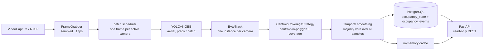

# Smart Parking Occupancy Detector

A real-time parking-occupancy system. Camera feeds (recorded video files or
RTSP streams) are sampled, run through **YOLOv8** (PyTorch) for vehicle
detection and **ByteTrack** for multi-frame tracking, matched against
per-spot polygons, temporally smoothed, and the resulting occupancy state
for 200+ parking spots is persisted to **PostgreSQL** and served through a
**FastAPI** API. The whole stack ships as **Docker Compose** (Postgres +
API + worker).

## Architecture

The layering is deliberate and enforced: `api/` never touches a SQLAlchemy
model from a route body, and `services/` never imports `fastapi`. That
boundary is what keeps `services/` unit-testable with synthetic data, no app
and no GPU. Full diagrams and the named design patterns (Adapter, Strategy,
Pipeline, Producer–Consumer, Repository, Facade, Observer) are in
[`docs/architecture.md`](docs/architecture.md).



The worker (detect/track/persist) and the API (read/serve) are **separate
processes**. A `GET` never triggers inference; a worker crash on one camera
never takes down the API or the other cameras.

## Repository layout

```
backend/
  app/
    api/         FastAPI routes + Pydantic schemas (no SQLAlchemy models here)
    core/        env-driven Settings
    db/          SQLAlchemy models, async session, camera_id-scoped queries, Alembic
    domain/      pure dataclasses: Detection, Track, SpotState (no cv2/torch/sqlalchemy)
    services/
      capture/     FrameGrabber (OpenCV VideoCapture adapter)
      detection/   YOLOv8 adapter — loads model once, batched, vehicle-class filter
      tracking/    ByteTrack adapter — one instance per camera
      occupancy/   OccupancyStrategy + temporal smoothing
      pipeline/    run_pipeline Facade wiring every stage
  worker/        run_worker.py — runs the pipeline continuously
  scripts/       annotate_spots, seed_demo, evaluate_accuracy, benchmark_latency,
                 load_test_scale, visualize_occupancy, infer_spot_grid
  tests/         pytest — synthetic detections/frames only, no live inference
docker/          api.Dockerfile, worker.Dockerfile, docker-compose.yml
docs/            evaluation.md (accuracy + latency results), architecture.md
models/          YOLOv8 weights (gitignored)
data/            sample video, spot polygons, eval ground truth (gitignored)
```

## Quickstart — Docker (full stack)

```bash
cp backend/.env.example backend/.env          # defaults work as-is for compose
# fetch the aerial checkpoint once, and drop a video at data/<your>.mov:
#   uv run python -c "from ultralytics import YOLO; YOLO('yolov8n-obb.pt')" && mv yolov8n-obb.pt models/
docker compose -f docker/docker-compose.yml up -d
docker compose -f docker/docker-compose.yml logs -f worker
```

`migrate` applies Alembic migrations once, then `api` (on host port **8001**)
and `worker` start. Seed a demo camera + spots with
`docker compose ... run --rm worker uv run python scripts/seed_demo.py`.

## Quickstart — local dev

```bash
cd backend
uv sync
docker compose -f ../docker/docker-compose.yml up -d db     # Postgres on host port 5434
uv run alembic upgrade head
uv run python scripts/seed_demo.py                          # one demo camera + spots
uv run uvicorn app.main:app --reload                        # API on :8000
uv run python -m worker.run_worker                          # pipeline, runs until killed
```

Every threshold, weights path, and sampling rate is read from
`Settings`/`.env` — see [`backend/.env.example`](backend/.env.example) for
the full list (`DATABASE_URL`, `YOLO_WEIGHTS_PATH`, `YOLO_CONF_THRESHOLD`,
`YOLO_IMGSZ`, `OCCUPANCY_COVERAGE_THRESHOLD`, `OCCUPANCY_IOU_THRESHOLD`,
`SMOOTHING_WINDOW`, `SAMPLE_FPS`). Camera source URIs live in the `cameras`
table, not `.env`.

## API

| Method | Path | Returns |
|--|--|--|
| `GET` | `/healthz` | liveness/readiness |
| `GET` | `/api/cameras` | configured cameras (source URIs deliberately omitted) |
| `GET` | `/api/cameras/{id}/spots` | that camera's annotated spot polygons |
| `GET` | `/api/occupancy` | current occupancy for every spot (served from cache) |
| `GET` | `/api/occupancy/{spot_id}/history` | append-only transition log for one spot |
| `GET` | `/api/metrics` | totals + latest `pipeline_runs` latency per camera |

Interactive docs at `/docs` when the API is running.

## Watch it work

```bash
cd backend
uv run python scripts/infer_spot_grid.py --video ../data/parking_lot.mov \
    --output scripts/spot_layouts/parking_lot_full.json      # once: infer a full-lot layout
uv run python scripts/visualize_occupancy.py --video ../data/parking_lot.mov \
    --spots-json scripts/spot_layouts/parking_lot_full.json \
    --output ../data/parking_lot_annotated.mp4
```

Renders the full clip with every visible stall outlined — green (free) or
red (occupied) — plus every raw vehicle detection in amber, and a live
header (`vehicles detected` / `spots occupied`). `infer_spot_grid.py`
clusters the detector's own output into rows/columns and derives each
row's stall size and spacing from its own members (never a fixed grid),
filling gaps between parked cars so empty stalls get a box too. **This
full-lot layout is a visualization convenience with no ground truth of its
own** — the accuracy figure below is measured on the separate,
hand-verified 20-spot set, not on this one.

## Evaluation

Full methodology, before/after, and reproducible commands in
[`docs/evaluation.md`](docs/evaluation.md). Headline numbers:

- **Accuracy** — per-spot occupancy on a 20-spot ground-truth set (two
  clearly-legible rows of `data/parking_lot.mov`):
  - stock COCO `yolov8n.pt`: **17.6%** — the footage is a straight-down
    drone shot and COCO has no overhead-vehicle imagery, so parked cars are
    classified `cell phone`. A viewpoint domain-shift problem (confidence,
    resolution and `yolov8s` were all ruled out), not a tuning one.
  - DOTA-pretrained aerial `yolov8n-obb.pt` + coverage-based matching:
    **100% (20/20)**, 252 vehicles detected on frame 0 (0 spurious). Same
    YOLOv8 stack, a *pretrained* checkpoint — no custom training. 20 spots
    is a small, honestly-scoped set; a lot-wide number needs a full
    interactive annotation pass.
- **Latency** — single camera / 20 spots, CPU: **p95 ~0.6s** against a 2s
  budget. The aerial model is ~20× heavier than the old nano model, and CPU
  inference doesn't batch in parallel, so the CPU fallback holds the budget
  to ~3–4 concurrent cameras (~60–80 spots); **200+ spots needs a GPU** (or
  ONNX export / lower `YOLO_IMGSZ`).

## Testing

```bash
cd backend
uv run pytest                          # api/ tests need a running Postgres (see below)
uv run ruff check . && uv run ruff format --check .
uv run mypy app worker --strict
```

CI (`.github/workflows/backend-ci.yml`) runs all four with a Postgres
service container. The `services/`, `domain/`, and `db/` suites are
pure-function / synthetic-data only — **no model download, no real video, no
GPU**. The `tests/api/` suite builds a disposable Postgres schema per test
(SQLite can't run the `JSONB` column or the `INSERT … ON CONFLICT` upsert),
so it needs `docker compose up db` locally.

## What's deliberately out of scope

No authentication, no message broker, no Kubernetes, no live dashboard.
This is a single-operator system sized for one lot's worth of cameras —
adding multi-tenant auth or a job queue before a real load test shows the
current design can't keep up would be premature.
