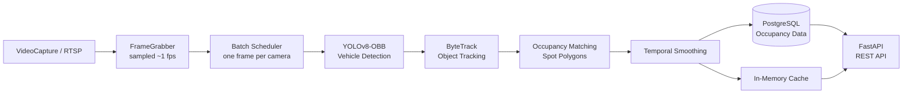

# Smart Parking Occupancy Detector

A real-time parking occupancy system using **YOLOv8**, **ByteTrack**, **FastAPI**, **PostgreSQL**, and **Docker**.

It detects vehicles from video/RTSP streams, tracks them across frames, determines whether parking spots are occupied, and stores the results for API access.

## Architecture



The **worker** handles detection, tracking, and persistence, while the **API** serves occupancy data independently.

## Tech Stack

* **YOLOv8 + PyTorch** — vehicle detection
* **ByteTrack** — multi-frame tracking
* **OpenCV** — video processing
* **FastAPI** — REST API
* **PostgreSQL** — occupancy storage
* **Docker Compose** — deployment
* **Pytest / Ruff / MyPy** — testing and code quality

## Project Structure

```text
backend/
  app/
    api/          API routes
    core/         Configuration
    db/           Database models & migrations
    domain/       Core data models
    services/     Capture, detection, tracking & occupancy
  worker/         Inference pipeline
  scripts/        Utilities and evaluation
  tests/          Automated tests

docker/           Docker configuration
docs/             Architecture & evaluation
models/           YOLO weights
data/             Videos & parking spot data
```

## Quickstart

### Docker

```bash
cp backend/.env.example backend/.env

docker compose -f docker/docker-compose.yml up -d

docker compose -f docker/docker-compose.yml logs -f worker
```

### Local Development

```bash
cd backend
uv sync

docker compose -f ../docker/docker-compose.yml up -d db

uv run alembic upgrade head
uv run python scripts/seed_demo.py

uv run uvicorn app.main:app --reload
```

API documentation:

```text
http://localhost:8000/docs
```

## API

| Method | Endpoint                           | Description       |
| ------ | ---------------------------------- | ----------------- |
| `GET`  | `/healthz`                         | Health check      |
| `GET`  | `/api/cameras`                     | List cameras      |
| `GET`  | `/api/cameras/{id}/spots`          | Get parking spots |
| `GET`  | `/api/occupancy`                   | Current occupancy |
| `GET`  | `/api/occupancy/{spot_id}/history` | Occupancy history |
| `GET`  | `/api/metrics`                     | System metrics    |

## Evaluation

Tested on a 20-spot ground-truth dataset:

* **100% occupancy accuracy (20/20)**
* **~0.6s p95 latency** on CPU for one camera
* Supports **200+ parking spots**
* GPU recommended for multiple cameras

More details: [`docs/evaluation.md`](docs/evaluation.md)

## Testing

```bash
cd backend

uv run pytest
uv run ruff check .
uv run ruff format --check .
uv run mypy app worker --strict
```

## Demo 

https://github.com/user-attachments/assets/3c40264c-987b-4335-95d5-7d8e1ad5bf03
