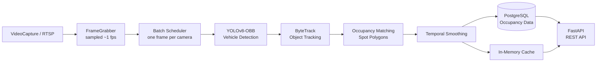

<div align="center">

# 🅿️ Smart Parking Occupancy Detector

**Real-time parking occupancy detection and monitoring.**

Detect vehicles from video or RTSP streams, track them across frames, determine parking-space occupancy, and expose the results through a REST API.

[](#)
[](#)
[](#)
[](#)
[](#)

</div>

---

## 📖 Table of Contents

* [✨ Features](#-features)
* [🧠 How It Works](#-how-it-works)
* [🛠️ Tech Stack](#️-tech-stack)
* [📁 Project Structure](#-project-structure)
* [⚙️ Getting Started](#️-getting-started)
* [🔌 API](#-api)
* [📊 Evaluation](#-evaluation)
* [🧪 Testing](#-testing)
* [🎬 Demo](#-demo)

---

## ✨ Features

|                             |                                                         |
| --------------------------- | ------------------------------------------------------- |
| 🚗 **Vehicle Detection**    | Detects vehicles using YOLOv8-OBB                       |
| 🎯 **Object Tracking**      | ByteTrack tracks vehicles across frames                 |
| 🅿️ **Occupancy Detection** | Matches tracked vehicles against parking-spot polygons  |
| 📈 **Temporal Smoothing**   | Stabilizes occupancy results and reduces flickering     |
| ⚡ **Low Latency**           | ~0.6s p95 CPU latency for one camera                    |
| 📡 **RTSP Support**         | Processes live camera streams                           |
| 🗄️ **Persistent Storage**  | Stores occupancy data in PostgreSQL                     |
| 🔌 **REST API**             | Provides current occupancy, history, and system metrics |

---

## 🧠 How It Works



The **worker** handles frame capture, detection, tracking, occupancy calculation, and persistence.

The **FastAPI service** runs independently and serves the latest occupancy data through the API.

---

## 🛠️ Tech Stack

| Layer            | Technology          |
| ---------------- | ------------------- |
| Detection        | YOLOv8-OBB, PyTorch |
| Tracking         | ByteTrack           |
| Video Processing | OpenCV              |
| Backend          | FastAPI             |
| Database         | PostgreSQL          |
| Deployment       | Docker Compose      |
| Testing          | Pytest              |
| Code Quality     | Ruff, MyPy          |

---

## 📁 Project Structure

```text id="b7z4gk"
backend/
├── app/
│   ├── api/          API routes
│   ├── core/         Configuration
│   ├── db/           Database models & migrations
│   ├── domain/       Core data models
│   └── services/     Capture, detection, tracking & occupancy
├── worker/           Inference pipeline
├── scripts/          Utilities and evaluation
└── tests/            Automated tests

docker/               Docker configuration
docs/                 Architecture & evaluation
models/               YOLO weights
data/                 Videos & parking spot data
```

---

## ⚙️ Getting Started

### Docker

```bash id="4t3qyr"
cp backend/.env.example backend/.env

docker compose -f docker/docker-compose.yml up -d

docker compose -f docker/docker-compose.yml logs -f worker
```

### Local Development

```bash id="b5r1qk"
cd backend
uv sync

docker compose -f ../docker/docker-compose.yml up -d db

uv run alembic upgrade head
uv run python scripts/seed_demo.py

uv run uvicorn app.main:app --reload
```

API documentation:

```text
http://localhost:8000/docs
```

---

## 🔌 API

| Method | Endpoint                           | Description       |
| ------ | ---------------------------------- | ----------------- |
| `GET`  | `/healthz`                         | Health check      |
| `GET`  | `/api/cameras`                     | List cameras      |
| `GET`  | `/api/cameras/{id}/spots`          | Get parking spots |
| `GET`  | `/api/occupancy`                   | Current occupancy |
| `GET`  | `/api/occupancy/{spot_id}/history` | Occupancy history |
| `GET`  | `/api/metrics`                     | System metrics    |

---

## 📊 Evaluation

Tested on a **20-spot ground-truth dataset**:

| Metric                 |           Result |
| ---------------------- | ---------------: |
| 🎯 Occupancy Accuracy  | **90%+ (266/280)** |
| ⚡ p95 CPU Latency      |        **~0.6s** |
| 🅿️ Supported Capacity |   **200+ spots** |

> 💡 GPU acceleration is recommended when processing multiple cameras.

More details: [`docs/evaluation.md`](docs/evaluation.md)

---

## 🧪 Testing

```bash
cd backend

uv run pytest
uv run ruff check .
uv run ruff format --check .
uv run mypy app worker --strict
```

---

## 🎬 Demo

https://github.com/user-attachments/assets/3c40264c-987b-4335-95d5-7d8e1ad5bf03

