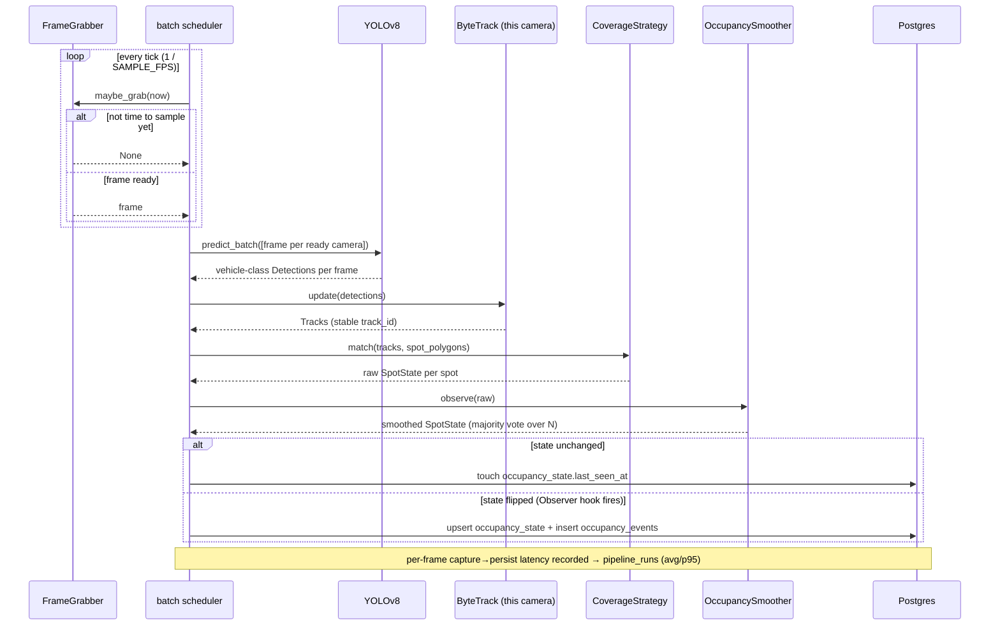

# Architecture

This document covers the system's layering, data flow, and the design
patterns each layer follows.

## The one rule everything else follows from

`api/` never imports a SQLAlchemy model into a route body. `services/` never
imports `fastapi`. `domain/` imports neither OpenCV, torch, nor SQLAlchemy.

That boundary is the whole point: it lets `services/` and `domain/` be
unit-tested with synthetic bboxes and polygons — no running app, no
database, no GPU, no model download in CI.

## Component view

```mermaid
flowchart TB
    subgraph worker [worker process — continuous]
        FG[capture/<br/>FrameGrabber<br/><i>Adapter</i>]
        SCH[pipeline/<br/>run_pipeline<br/><i>Facade + Pipeline</i>]
        YOLO[detection/<br/>YoloDetector<br/><i>Adapter</i>]
        BT[tracking/<br/>ByteTrackAdapter<br/><i>Adapter, 1 per camera</i>]
        MATCH[occupancy/<br/>CentroidCoverageStrategy<br/><i>Strategy</i>]
        SMOOTH[occupancy/<br/>OccupancySmoother<br/><i>Observer hook</i>]
        WR[db/writer.py<br/>async DB writer]
    end

    subgraph api [api process — request/response]
        RT[routes/<br/>cameras · spots · occupancy · metrics · health]
        CACHE[api/cache.py<br/>OccupancyCache<br/>short-TTL read-through]
    end

    subgraph pg [(PostgreSQL 16)]
        T1[cameras]
        T2[parking_spots]
        T3[occupancy_state — upserted]
        T4[occupancy_events — append-only]
        T5[pipeline_runs — latency evidence]
    end

    FG --> SCH
    SCH --> YOLO --> BT --> MATCH --> SMOOTH --> WR
    WR --> T3 & T4 & T5
    SCH -. reads cameras+spots at startup .-> T1
    SCH -. reads cameras+spots at startup .-> T2
    RT --> CACHE --> T3
    RT --> T1 & T2 & T4 & T5
```

The worker and API are **separate OS processes** (separate containers).
They share only Postgres. Nothing pushes into the API's cache — it refreshes
itself from `occupancy_state` once its 1s TTL lapses, because the Observer
hook that fires on a state transition only runs inside the worker.

## Data flow (one camera, steady state)



## Named patterns

| Pattern | Where | Purpose |
|---|---|---|
| Adapter | `services/detection/yolo.py`, `services/tracking/byte_track.py`, `services/capture/frame_grabber.py` | Ultralytics / ByteTrack / OpenCV quirks isolated behind a stable internal call |
| Strategy | `services/occupancy/matching.py` | Interchangeable spot-occupancy rules behind one `OccupancyStrategy` interface — default `CentroidCoverageStrategy` (centroid-in-polygon **and** vehicle-coverage ≥ threshold); `CentroidIoUStrategy` is the swappable alternative |
| Pipeline | `services/pipeline/run_pipeline.py` | capture → detect → track → map → smooth → persist; each stage consumes the previous stage's output, independently testable |
| Producer–Consumer | `services/capture` → batch scheduler → batched detector | Decouples per-camera frame timing from inference throughput; one `predict_batch` call per tick covers every active camera |
| Repository | `db/scoped.py` | One place builds every `camera_id`-scoped query — routes never hand-write a `WHERE camera_id` |
| Facade | `services/pipeline` (`run_pipeline(...)`) | The worker calls one function, not five submodules; persistence is an injected async callback, so the Facade has no SQLAlchemy dependency |
| Observer | `services/occupancy/state.py` `on_transition` hook | A spot flip → DB event insert + cache concerns, decoupled from the matcher |

## Why the pipeline is its own process, not `BackgroundTasks`

Video inference is continuous and indefinite, not a short webhook-triggered
job. Running it inside the API process would mean a worker crash or restart
takes the API down with it, and `BackgroundTasks` offers no supervision or
backpressure. `worker/run_worker.py` is its own container: it reads active
`cameras` (and their spots, through the same `db/scoped.py` helper the API
uses) at startup, loads **one** YOLO model, builds one `FrameGrabber` + one
`ByteTrackAdapter` per camera, and hands everything to `run_pipeline`. The
API container only reads `occupancy_state` / `occupancy_events`.

## Latency budget

End-to-end frame-capture → `occupancy_state` write ≤ 2s per camera at the
default sampling rate, measured and stored per run in `pipeline_runs`
(avg + p95). Levers, in order: sample rate (1 frame / 1–2s, not full
framerate — a spot doesn't change state mid-second), batched cross-camera
inference, model loaded once. Escalation path if the budget is ever missed:
ONNX export or smaller input resolution before more hardware. Measured
results: [`evaluation.md`](evaluation.md).
